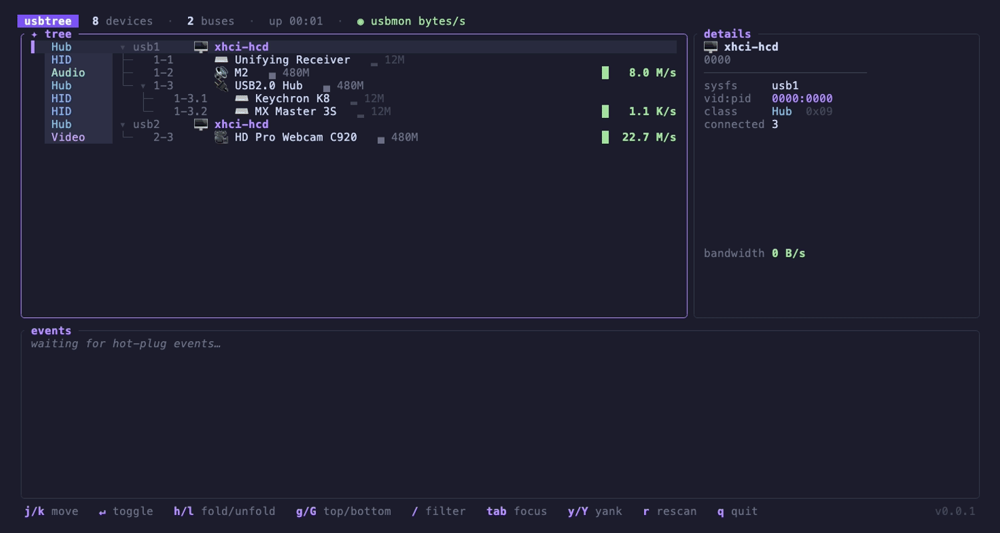

# usbtree

Cross-platform TUI for inspecting the USB device tree (Linux, macOS, Windows). Enumerates devices via [nusb](https://crates.io/crates/nusb) — pure Rust, no root, no libusb.


[](LICENSE)
[](https://github.com/gnomeria/usbtree/actions/workflows/ci.yml)
[](https://github.com/gnomeria/usbtree/releases/latest)

**Website:** [gnomeria.github.io/usbtree](https://gnomeria.github.io/usbtree)



## Install

> [!NOTE]
> The shell installer and prebuilt binary links require a published GitHub release. If no release is available yet, install from source.

### Shell script (Linux, macOS)

```sh
curl -fsSL https://raw.githubusercontent.com/gnomeria/usbtree/main/scripts/install.sh | sh
```

Downloads the latest release for your platform, verifies its sha256 against `checksums.txt`, and installs to `/usr/local/bin` (if writable) or `~/.local/bin`. Customize with environment variables:

| Variable              | Effect                                                     |
| --------------------- | ---------------------------------------------------------- |
| `USBTREE_VERSION`     | install a specific version, e.g. `0.0.1` (default: latest) |
| `USBTREE_INSTALL_DIR` | install directory override                                 |

### Prebuilt binaries

Grab an archive from the [latest release](https://github.com/gnomeria/usbtree/releases/latest):

| Platform            | Asset                                   |
| ------------------- | --------------------------------------- |
| Linux x86_64        | `usbtree_<version>_linux-amd64.tar.gz`  |
| Linux arm64         | `usbtree_<version>_linux-arm64.tar.gz`  |
| macOS Apple Silicon | `usbtree_<version>_darwin-arm64.tar.gz` |
| Windows x86_64      | `usbtree_<version>_windows-amd64.zip`   |

Every archive's sha256 is listed in the release's `checksums.txt`.

> [!NOTE]
> The macOS and Windows binaries are **not code-signed or notarized**.
>
> - **macOS**: Gatekeeper quarantines downloaded binaries. The install script clears the flag for you; if you download manually, run `xattr -d com.apple.quarantine ./usbtree` (or right-click → Open once).
> - **Windows**: SmartScreen may show "Windows protected your PC" — click _More info_ → _Run anyway_, or unblock the file: `Unblock-File usbtree.exe` in PowerShell.
>
> If in doubt, verify the archive's sha256 against `checksums.txt`, or build from source.

### From source

```sh
cargo install --git https://github.com/gnomeria/usbtree   # or clone + cargo build --release
```

## Features

- Live USB tree with a color-coded class gutter, per-class icons, and tree rails; rescans every second
- Names resolved through a fallback chain: personal overrides → device descriptor strings → downloaded [usb.ids](http://www.linux-usb.org/usb-ids.html) (`--updatelist`) → embedded usb.ids snapshot → vendor + class heuristics
- Collapse/expand hubs with `Enter`/`Space` (or `h`/`l`) — collapsed nodes show `▸` and a `+N` child badge
- Composite/Misc (0xef) devices are classified by their interface classes, so e.g. a MOTU M2 audio interface shows as Audio, not Misc
- Hot-plug watch: plugged devices flash green, unplugged devices linger as red crossed-out ghosts for 30 s, and every event lands in a timestamped log panel
- Live per-device activity (Linux): inline sparklines in the tree plus a bandwidth graph in the detail panel — URBs/s unprivileged, real bytes/s when usbmon is readable (see below)
- Speed badges with tier glyphs: `▂` low/full, `▄` high (480M), `█` SuperSpeed+ (5G/10G)
- Detail panel: sysfs path, vid:pid, vendor, class, speed, serial, connected children
- `usbtree --dump` prints the tree once to stdout (no TUI)

## Usage

```sh
usbtree                 # TUI
usbtree --dump          # print the tree once and exit
usbtree --updatelist    # download the latest usb.ids into the config dir
usbtree --demo          # fake device tree with scripted hot-plug + traffic
```

`--demo` needs no USB access at all — it's what the screenshots are recorded from, and a quick way to preview the UI (combine with `--dump` for a one-shot fake tree).

| Key                   | Action              |
| --------------------- | ------------------- |
| `j`/`k`, arrows       | move selection      |
| `Enter`/`Space`       | collapse/expand hub |
| `h`/`←`, `l`/`→`      | fold / unfold       |
| `g`/`Home`, `G`/`End` | top / bottom        |
| `r`                   | force rescan        |
| `q` / `Esc`           | quit                |

## Configuration

Config lives in `~/.config/usbtree/` (`%APPDATA%\usbtree\` on Windows):

- **`overrides.ids`** — personal naming heuristics, one `vvvv:pppp Friendly Name` per line (`#` comments allowed). Wins over descriptor strings and usb.ids:

  ```
  07fd:000b MOTU M2 Audio Interface
  ```

- **`usb.ids`** — written by `usbtree --updatelist` (fetched from the [systemd/hwdata](https://github.com/systemd/hwdata) mirror). When present it takes priority over the usb.ids snapshot compiled into the binary.

## Activity metrics (Linux)

The header shows which source is active:

- **`◌ urb activity`** — unprivileged default: URB-count deltas from sysfs `urbnum`, shown as relative activity (URBs/s)
- **`◉ usbmon bytes/s`** — real per-device bandwidth when usbmon is readable. usbtree tries `/sys/kernel/debug/usb/usbmon/0u` first, then falls back to `/dev/usbmon0` on Linux systems where kernel lockdown restricts debugfs.
- **`⚠ usbmon not loaded — modprobe usbmon`** — shown when usbtree is already running as root on Linux, but the usbmon device is missing. Run `sudo modprobe usbmon`, then restart usbtree.
- **`⚠ usbmon blocked by kernel lockdown`** — shown when usbtree is already running as root, but the kernel refuses debugfs usbmon access because lockdown is active and the `/dev/usbmon0` fallback is also unavailable.

For bytes/s on Linux, run as root with the `usbmon` module loaded:

```sh
sudo modprobe usbmon
sudo usbtree
```

If Secure Boot or kernel lockdown blocks debugfs, usbtree will use `/dev/usbmon0` automatically when available. If the lockdown warning remains, confirm `usbmon` is loaded and `/dev/usbmon0` exists before changing Secure Boot or lockdown settings.

On macOS and Windows the tree, details, and hot-plug log all work; activity sparklines are not available.

## How it works

The tree rescans every second; hot-plug detection is a snapshot diff between scans. Device paths use sysfs-style naming (`1-1.4` = bus 1, port 1, port 4) on every platform, built from each device's port chain. Root hubs are synthesized from the bus list.

Releases are automated with [release-please](https://github.com/googleapis/release-please): conventional commits on `main` roll up into a release PR, and merging it tags a version and builds the binaries above.

## Development

Common commands live in the [Taskfile](https://taskfile.dev) — run `task -l` (or bare `task`) to list them: `task demo` runs the TUI on fake data, `task test` / `task lint` / `task ci` mirror what CI checks, `task shots` re-renders the screenshots, and `task hooks` enables the pre-commit secrets scan once per clone.

Contributions are welcome; see [CONTRIBUTING.md](CONTRIBUTING.md). Security reports should follow [SECURITY.md](SECURITY.md).

## Screenshots pipeline

The demo GIF and PNG in `docs/screenshots/` are rendered headlessly — no real hardware — by driving `usbtree --demo` with [VHS](https://github.com/charmbracelet/vhs) tapes from `tapes/`. The [Screenshots workflow](.github/workflows/screenshots.yml) re-renders and commits them whenever `src/` or the tapes change on `main`; locally, run `scripts/shots.sh` (needs `vhs` installed).

## License

usbtree is licensed under the [MIT License](LICENSE).
